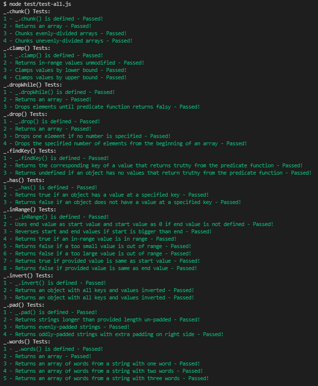

# **Recreating Lodash**

In this project, I implemented some of the widely-used functionalities of [lodash.js](https://lodash.com/docs/4.17.10/) library. This training project, prepared by [Codecademy](https://www.codecademy.com/learn/paths/full-stack-engineer-career-path), has been an invaluable exercise in enhancing my problem-solving skills.

## Table of Contents

- [General information](#general-information)
- [Technologies](#technologies)
- [Setup](#setup)
- [Sources](#sources)

## General information

Codecademy has selected the following methods to recreate and implement in "_.js":

1. _.clamp()
2. _.inRange()
3. _.words()
4. _.pad()
5. _.has()
6. _.invert()
7. _.findKey()
8. _.drop()
9. _.dropWhile()
10. _.chunk()

## Technologies

- JavaScript ES6

## Setup

To check my program, Codecademy has written several JavaScript files inside the directory named "test". To test whether or not my code was written successfully, run the JavaScript file that will evaluate a specific method in the Lodash library.

To check all methods at the same time, run test/test-all.js and check the console's output. I ran the same file and the console provided this information:  \
&nbsp;

## Sources

The techniques utilized was based on the lessons taught in [Codecademy's Full-Stack Career Path](https://www.codecademy.com/learn/paths/full-stack-engineer-career-path). The files used to test my code was provided by Codecademy as well.
